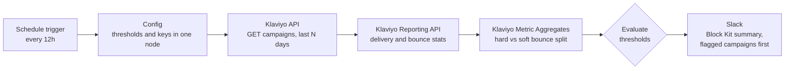
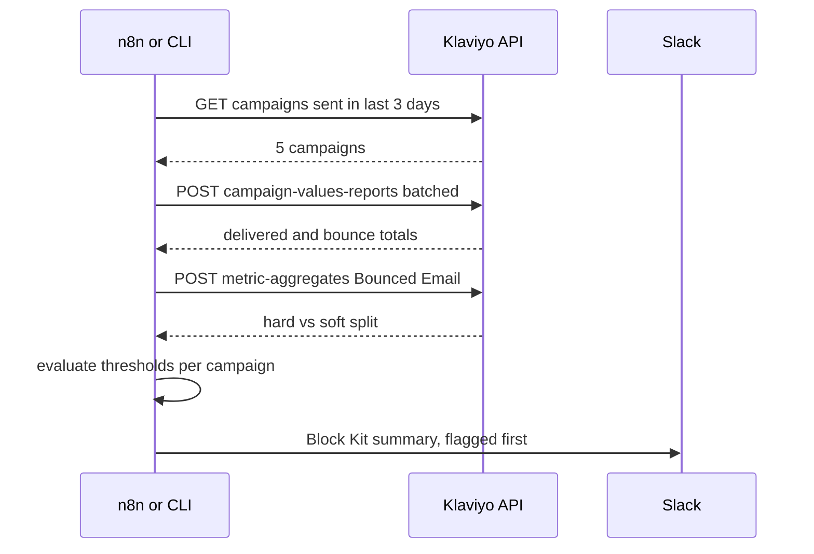

# Klaviyo Bounce Monitor → Slack

A lightweight bot that pulls Klaviyo campaigns sent in the last 3 days, checks
**hard / soft / total bounce rates** against configurable thresholds, and posts
a summary to Slack flagging anything elevated.

Built as one clean n8n workflow, plus a zero-dependency mock of the Klaviyo API
so the whole pipeline can be demoed end to end **before any real credentials
are shared**.

## Architecture



Three data sources are joined per campaign:

| Data | Endpoint | Why |
|---|---|---|
| Campaigns sent in window | `GET /api/campaigns` (filtered on `scheduled_at`) | the "last 3 days" scope |
| Recipients, delivered, total bounces | `POST /api/campaign-values-reports` | totals + total bounce rate |
| Hard vs soft split | `POST /api/metric-aggregates` on the *Bounced Email* metric | hard and soft thresholds separately |

One monitoring run, end to end:



Severity: hard-bounce breach → 🔴 (reputation risk), soft/total breach → 🟠,
otherwise ✅ listed as healthy in a compact footer.

## Quick start (demo mode, no credentials)

```bash
# 1. start the mock Klaviyo API (Python stdlib only, no pip install)
python3 mock_klaviyo_server.py

# 2a. run the pipeline as a script (fastest way to see it work)
python3 bounce_monitor.py --mock --preview
#    -> prints per-campaign rates, the Slack payload, and writes slack_preview.html

# 2b. or run it in n8n
docker run -d --name n8n-demo --add-host=host.docker.internal:host-gateway \
  -p 5678:5678 -e N8N_SECURE_COOKIE=false -v n8n-data:/home/node/.n8n n8nio/n8n
# import n8n_workflow.json (or use the CLI import below), open http://localhost:5678,
# hit "Execute workflow" — all nodes run against the mock, including the Slack post.
```

CLI import + headless execution (what the verification below used):

```bash
docker run --rm --add-host=host.docker.internal:host-gateway \
  -v n8n-data:/home/node/.n8n -v "$PWD":/import:ro n8nio/n8n \
  import:workflow --input=/import/n8n_workflow.json

docker run --rm --add-host=host.docker.internal:host-gateway \
  -e N8N_RUNNERS_ENABLED=false -v n8n-data:/home/node/.n8n n8nio/n8n \
  execute --id KlaviyoBounceMon01
```

The mock dataset contains 5 campaigns: one with an elevated hard-bounce rate
(3.3%, a list-decay scenario), one with elevated soft bounces (2.3%,
inbox-full/deferrals), and three healthy — so the monitor always has something
to flag in a demo.

## Going live

Everything account-specific lives in **one place** — the `Config` node in n8n
(or `config.json` + env vars for the script):

| Setting | Demo value | Live value |
|---|---|---|
| `klaviyoBaseUrl` | `http://host.docker.internal:8778` | `https://a.klaviyo.com` |
| `klaviyoApiKey` | ignored by mock | private key, read scope: Campaigns + Metrics |
| `slackWebhookUrl` | mock `/slack` endpoint | a Slack incoming webhook |
| thresholds | hard 0.5% / soft 2% / total 2% | tune per account baseline |

Notes for the live switch:

- The mock mirrors the JSON:API shapes of Klaviyo revision `2025-04-15`; on
  first live run we validate against the account's actual payloads (statistic
  names and the bounce-type dimension are the two places Klaviyo has changed
  before) and adjust the two Code nodes if needed.
- Klaviyo rate limits are generous for this volume (a handful of calls per
  run); the reporting call batches all campaigns in one request.
- The script (`bounce_monitor.py`) and the n8n workflow implement the same
  three calls, the same threshold logic, and the same Slack payload — the
  script doubles as a test harness and a fallback deployment (cron) if n8n
  ever isn't wanted.

## Files

| File | What |
|---|---|
| `n8n_workflow.json` | the importable n8n workflow (the deliverable) |
| `mock_klaviyo_server.py` | stdlib mock of the 3 Klaviyo endpoints + a stand-in Slack webhook |
| `bounce_monitor.py` | same pipeline as a zero-dependency CLI; `--preview` renders the Slack message to HTML |
| `config.json` | thresholds + lookback window for the CLI |
| `slack_preview.html` | generated preview of the Slack message |

## Verified

`n8n execute --id KlaviyoBounceMon01` against the mock: all 7 nodes succeed —
5 campaigns fetched, stats joined, 2 flagged (1 hard 🔴, 1 soft 🟠), Block Kit
message accepted by the webhook endpoint. Same result from
`bounce_monitor.py --mock`.

## Obvious next iterations (once real data is visible)

- Per-account baselines (trailing 30-day mean + N sigma) instead of fixed thresholds
- Extra metrics: spam complaints, unsubscribes, deliverability by domain (Gmail/Outlook/Yahoo)
- Alert routing: digest vs instant, severity → channel mapping, quiet hours
- Flows coverage (the same reporting API has `flow-values-reports`)

---

*Built by [Bohea Still](https://boheastill.com/?r=gh-klaviyo) — independent developer taking on automation, AI-pipeline and integration projects.*
